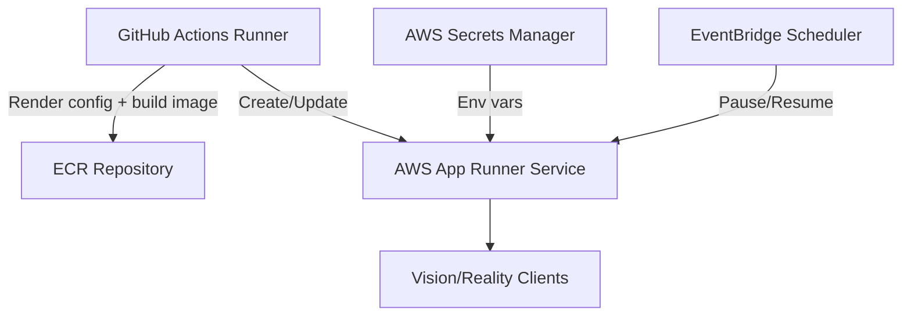

# AWS App Runner Plan

## Overview
- **Objective:** Deliver the Vision/Reality service on fully managed infrastructure where App Runner handles scaling, TLS, and build automation while we supply pre-rendered configuration and container image.
- **Minimal runtime needs:** The container still only requires the Xray binary and rendered configuration directory; App Runner can mount them via baked image layers or runtime environment variables. No SSH or VM tooling is necessary.
- **Automation entry point:** GitHub Actions builds and pushes an image to Amazon ECR (App Runner compatible) and updates the service via CloudFormation or direct App Runner API.

## Reference Architecture

## Components & Responsibilities
- **Amazon ECR** stores the container image, versioned with commit SHA for reproducible rollbacks.
- **AWS App Runner service** runs the container, manages ingress TLS certificates automatically, and scales between provisioned and active instances.
- **Secrets Manager / Parameter Store** supplies Reality keys, UUID, and short IDs as environment variables.
- **EventBridge Scheduler** can pause the service during quiet hours (scales to zero) and resume before usage windows to minimize runtime charges.

## Deployment Workflow
1. **Render configuration artifacts** in GitHub Actions using repo tooling.
2. **Build and push** the container image to ECR with tags for environment (prod/staging) and commit SHA.
3. **Update App Runner** via `aws apprunner update-service` referencing the new image URI and environment variables.
4. **Health verification:** Use App Runner health checks (HTTP/TCP) or a simple `/healthz` endpoint proxied through Xray to confirm readiness before switching DNS.
5. **Pause schedule:** Create EventBridge rules or GitHub workflow dispatch to pause/resume the service nightly for cost savings.

## Cost Considerations
- Provisioned container instances cost **$0.007 per GB-hour** in us-east-1, keeping memory warm for fast response.【d21aa3†L24-L36】
- Active container instances cost **$0.064 per vCPU-hour** plus additional GB-hour charges when processing traffic.【d21aa3†L36-L44】
- Pausing the service halts active instance costs, leaving only provisioned instance charges if you keep a minimum instance online for instant start.

## Pros
- Managed TLS and HTTPS endpoints remove the need for Caddy or manual certificate handling.
- Scaling and zero-downtime deploys handled natively by App Runner.
- GitHub Action only needs AWS CLI container image—no Terraform state required for day-to-day redeploys.

## Cons
- Pricing is consumption based; sustained 24/7 workloads can exceed Lightsail instance costs unless carefully paused.【d21aa3†L24-L52】
- Currently limited to HTTP/TCP on standard ports; custom port exposure may require VPC integration and load balancer adjustments.
- Cold start when resuming from pause can exceed two minutes depending on image size; mitigate by keeping one provisioned instance.
