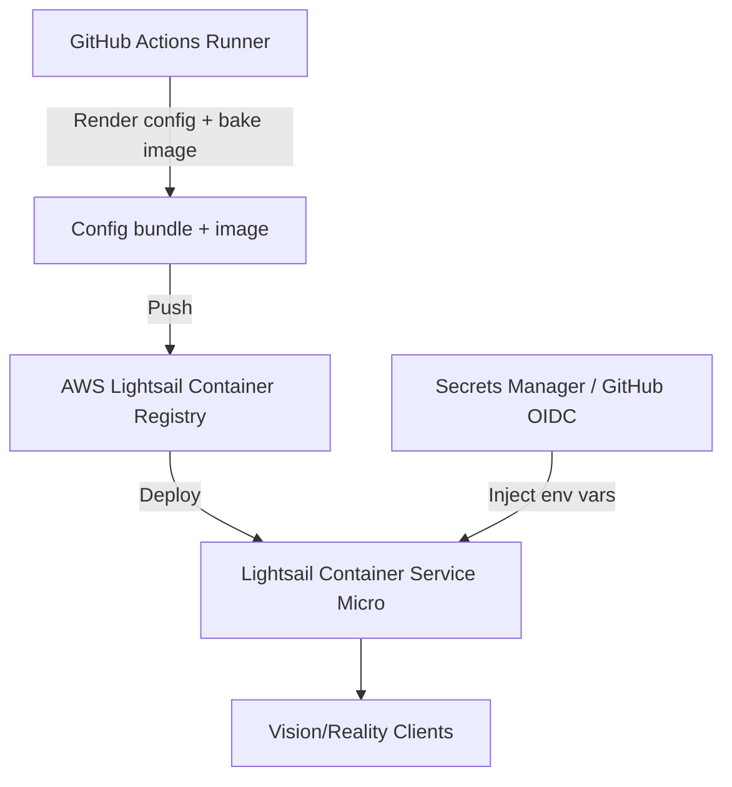

# AWS Lightsail Container Service Plan

## Overview
- **Objective:** Run the Xray Vision/Reality stack as a managed container on AWS Lightsail Container Service while keeping runtime configuration portable from the `less-vision-reality` automation.
- **Minimal runtime needs:** The stack only requires an OCI-compatible container runtime that can launch `ghcr.io/xtls/xray-core` with its rendered `/usr/local/etc/xray/config.json`, plus persisted Reality key pairs, UUID, and short IDs supplied through environment variables or mounted secrets. This avoids heavy tooling (Python, Ansible, Docker Compose CLI) during provisioning because artifacts can be templated ahead of time.
- **Automation entry point:** A GitHub Actions workflow builds the container image from the templated configuration bundle, pushes it to the Lightsail private registry, and issues a single `aws lightsail create-container-service-deployment` command.

## Reference Architecture

## Components & Responsibilities
- **GitHub Actions** renders `config.json` and `docker-compose.yml` templates using repository tooling, then builds a minimal single-container image that inlines the Xray binary and configuration assets.
- **AWS Lightsail Container Service (Micro plan)** hosts the container and offers optional persistent storage add-ons for logs or certificates if required later.
- **Lightsail Secret environment variables** store Reality private/public keys, UUID, and short IDs for reuse across redeployments.
- **GitHub OIDC role or Lightsail access key** authorizes the workflow to publish the container image and trigger deployments without long-lived credentials.

## Deployment Workflow
1. **Pre-render configuration:** Run the existing templating tasks (either locally or in GitHub Actions) to generate a ready-to-run config directory.
2. **Build minimal image:** Use a multistage Dockerfile (Alpine + Xray binary copy) to bundle the config directory and expose required ports.
3. **Push & deploy:** Authenticate to Lightsail Container Registry, push the tagged image, and call `aws lightsail create-container-service-deployment` with environment variables pointing at the persisted credentials.
4. **Scheduling controls:** Configure Lightsail auto-scaling to minimum `0` nodes overnight for cost savings, or script `aws lightsail update-container-service` within GitHub Actions/CloudWatch Events to stop the service on a schedule.
5. **Observability:** Enable Lightsail container logs and optionally forward to CloudWatch for request tracing.

## Cost Considerations
- The Micro container tier (1 node) is listed at **$10 USD/month** and currently includes three months free for new accounts.【f75632†L6-L24】
- Lightsail container data transfer quotas mirror instance bundles (1 TB+ depending on tier); exceeding quotas reverts to standard AWS data transfer rates, so monitor high-throughput proxy workloads.
- Stopping the service (setting desired nodes to 0) halts compute charges, leaving only registry storage and data transfer costs.

## Pros
- Eliminates VM provisioning time while keeping deployment under two minutes via managed container rollout.
- Built-in network allotment (1–2 TB) reduces exposure to per-GB egress fees for proxy traffic.【f75632†L6-L24】
- Simplified GitHub Action (one CLI invocation) minimises inline scripting risk.

## Cons
- No docker-compose support; multi-container expansion (e.g., metrics sidecars) requires refactoring into a single container or multiple services.
- Limited regional availability compared with EC2, which may impact latency-sensitive clients.
- Secrets must be injected at deployment; no native secret rotation workflow—needs GitHub Action or AWS Secrets Manager automation.
