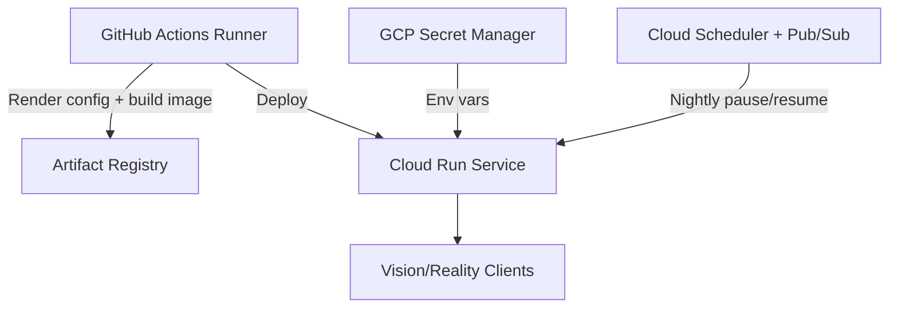

# Google Cloud Run Plan

## Overview
- **Objective:** Deploy the Vision/Reality container on Google Cloud Run for serverless execution with scale-to-zero and rapid redeployments driven by GitHub Actions.
- **Minimal runtime needs:** Cloud Run can run the same container image built from the rendered Xray configuration directory. Secrets (UUID, short IDs, Reality keys) are stored in Secret Manager and mounted as environment variables; no VM bootstrap is required.
- **Automation entry point:** GitHub Actions uses Workload Identity Federation to push the container to Artifact Registry and update the Cloud Run service via `gcloud run deploy`.

## Reference Architecture

## Components & Responsibilities
- **Artifact Registry** stores the container image versions with metadata (config checksum) for traceability.
- **Cloud Run service** executes the container with CPU always allocated during requests and optional minimum instances for warm capacity.
- **Secret Manager** holds Reality credentials and is bound to the Cloud Run service account with least privilege.
- **Cloud Scheduler** triggers Pub/Sub messages to set min/max instances (0/1) on a schedule, reducing runtime cost during idle periods.

## Deployment Workflow
1. **Render configuration** using repository tooling inside GitHub Actions.
2. **Build and push** container image to Artifact Registry; embed config files under `/usr/local/etc/xray`.
3. **Deploy** via `gcloud run deploy` with environment variables referencing Secret Manager or mounted volumes.
4. **Configure ingress** to allow only HTTPS on desired domain; optional Cloud CDN or Cloud Armor for additional protection.
5. **Automate scaling policy** by setting minimum instances to `0` overnight and `1` during active hours via Scheduler jobs.

## Cost Considerations
- Active CPU billing is **$0.000024 per vCPU-second** in us-central1, with memory at **$0.0000025 per GiB-second**; idle minimum instance time is cheaper at the same memory rate.【23a9c8†L1-L5】【23a9c8†L6-L7】
- Requests cost **$0.40 per 1 million**, so light control traffic remains inexpensive.【23a9c8†L8-L9】
- Scale-to-zero eliminates compute charges when unused; you only pay for storage and minimal request invocations.

## Pros
- Deployments complete in under two minutes by updating the service revision without provisioning any VMs.
- Built-in HTTPS endpoints remove the need for external certificate management.
- Fine-grained IAM and Workload Identity Federation keep GitHub Actions free from static service account keys.

## Cons
- Outbound egress uses Google’s Premium tier by default; cross-region bandwidth can add noticeable cost compared to Lightsail’s included quota.
- Persistent disk is not available; long-term log retention requires Cloud Logging sinks or external storage.
- Container must start within Cloud Run’s timeout; ensure image boots quickly (< 60s) or enable minimal instances.
